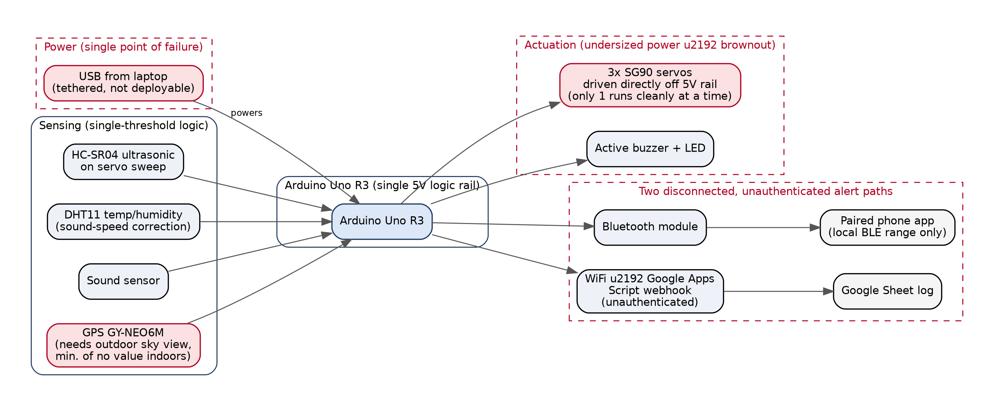
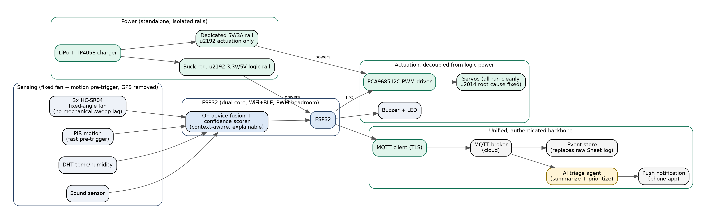

# Edge-Fusion Retrofit: from single-threshold alarm to a context-aware security node

**Liminal Apprentice Case Assessment, Embedded Software Engineering Track**
Candidate: Muhammad Zuhair Bin Mohamed Zulkifli · 15 July 2026
Base project: our team's IoT Intruder Detection Robot (Chan Yin Quan Gabriel, Chooi Yuan Zhen, Chow Jing Yuan Ewynn, Muhammad Zuhair Bin Mohamed Zulkifli)

See [`README.md`](./README.md) for the short version with runnable proof. This is the full write-up, answering the six questions from the brief.

---

## 1. Project framing and constraints

The Intruder Detection Robot was an Arduino Uno R3-based system built to monitor a fixed area, detect unauthorized presence, and alert a user. Per our own project brief, it was meant to send an update when an intruder is detected, detect unwanted objects, trigger alerts on intrusion, protect expensive items, and guard restricted areas.

In plain terms: an ultrasonic sensor sat on a servo, sweeping back and forth to check for anything entering the monitored area. When something got close enough, it sounded a local buzzer and LED, and sent an alert two separate ways, a Bluetooth push to a paired phone app, and a log entry in a Google Sheet over WiFi. A DHT11 temp/humidity sensor corrected the distance readings for the actual speed of sound in the room, and a sound sensor and GPS module were along for the ride as secondary inputs. The table below breaks down what each component was responsible for.

| Component | Role |
|---|---|
| Arduino Uno R3 | Mainboard |
| Servo motor | Rotates the sonar sensor to sweep the area |
| HC-SR04 ultrasonic sensor | Distance-based intrusion detection |
| DHT11 temp/humidity sensor | Corrects the speed-of-sound calculation for the sonar |
| Active buzzer + red LED | Local audible/visual alarm |
| GY-NEO6M GPS module | Location data |
| Sound sensor | Secondary detection signal |
| Bluetooth module | Pushes "Intruder!" notifications to a paired phone app |
| WiFi + Google Apps Script | Logs intrusion events as rows in a Google Sheet |

**These aren't hypothetical risks. They're documented findings from our own build and demo.**

The clearest one is the servo brownout, and it's a constraint the team measured directly: with three servos wired to the Uno's own 5V rail, only the main servo ran, and abnormally at that, while the other two twitched. With two servos, they moved one after another with visible pauses. Only a single servo behaved normally. The team's own finding was that a servo draws roughly 4.8-6V, so the shared 5V rail simply couldn't supply enough current for more than one at a time. That same single-sensor sweep is also why the servo couldn't rotate a full 360° and why the system couldn't track anything moving quickly, since a rotating sonar checks one angle at a time, not several at once. The HC-SR04 itself adds a hard physical ceiling too: 2cm to 400cm, nothing outside that range.

Power was another real limit. The system needed to stay tethered from the Arduino to a computer, so it never ran as a standalone deployed unit. The GPS module fared worse: it had to sit outdoors with a clear view of the sky and needed several minutes to get a fix, which makes it close to worthless for a security node meant to sit indoors.

Detection logic and alerting were the least mature parts. Our own literature review named reliability and false alarms as a market-wide challenge, yet the shipped logic was a single distance threshold, exactly the kind of rule that trips on a pet, a curtain, or a staff member walking past. Alerting was split across two disconnected channels: a Bluetooth notification that only reaches a phone already paired and in range, and a Google Sheet log running over an Apps Script webhook, unauthenticated by default.

## 2. The proposed upgrade

The "Edge-Fusion Retrofit" bundles three changes, each fixing one documented failure mode. Together they map onto the IoT characteristics the team itself defined in the original deck's trustworthiness, architectural, and functional framework.

**The power and actuation fix** moves all servo and buzzer current onto a dedicated 5V/3A rail, driven through a PCA9685 I2C PWM controller and off the MCU's own logic rail. It's a direct, root-cause fix for the exact brownout the team measured, not a workaround.

**Sensor fusion with on-device scoring** replaces the single rotating sonar and its 30cm threshold with three fixed-angle sonar sensors plus a PIR motion pre-trigger, combined by an explainable weighted-evidence scorer. This targets the team's own "context-awareness" and "real-time capability" characteristics, and the reliability and false-alarm problem their literature review raised.

**A unified, authenticated backbone** replaces the Bluetooth-app and unauthenticated-webhook split with a single TLS-secured MQTT path to a broker, backed by an AI triage agent that turns raw event streams into a short, human-readable briefing. This targets the team's own "confidentiality" and "network connectivity" characteristics.

Beyond fixing bugs, this also opens up new capabilities: standalone battery-powered deployment with no laptop tether, continuous multi-angle coverage instead of a slow mechanical sweep, a measurable drop in false-positive alerts with every suppressed event still logged for pattern review, a plain-language audit trail of why each alert fired instead of just a timestamp in a spreadsheet, and a secured, authenticated alert path instead of an open webhook.

## 3. AI-assisted design process

Here's how AI was actually used at each stage of this retrofit, roughly in the order it happened.

I started from the team's own "Observation and Findings" slide, which recorded symptoms but not a diagnosis. I used Claude to reason from the SG90 servo's known current draw against the Arduino Uno's shared 5V regulator budget, which confirmed the brownout hypothesis rather than just guessing at a fix. From there, the architecture had to change: the implied delay()-driven, single-loop Arduino style needed to become a non-blocking, millis()-based state machine on ESP32, since sonar polling, actuation, and a network stack all have to run concurrently without one blocking the others.

Code generation came next, but it wasn't a one-shot accept. Claude drafted the PCA9685 migration, the MQTT integration, and the fusion scorer, and I had it explicitly separate the scorer into a hardware-free module so it could actually be unit tested. That's a structural decision, not just generated syntax. Once the module existed, I had Claude generate a unit test suite covering the exact false-positive scenario the literature review called out, a single weak signal like a pet, plus the corroborating-evidence and cooldown paths, and then I compiled and ran them myself rather than assuming they'd pass.

The triage agent was a different kind of use: AI as part of the product, not just a development tool. It's a second, independent artifact that runs an LLM on the cloud side, turning a night's worth of raw scored events into a short, human-readable briefing. Finally, I ran a code review pass over the integration sketch for classic embedded pitfalls the original code likely had, blocking calls, no watchdog, no debounce, and added a 10-second watchdog and cooldown-based debounce as a direct result.

## 4. What was built: proof of work

Submitted alongside this write-up: `firmware/` (the ESP32 sketch plus the hardware-free fusion logic), `tests/` (a standalone unit test suite), `ai_agent/` (the triage agent plus sample data), and `diagrams/`. The two pieces below aren't just described. They were actually compiled and run, and the output shown is real, unedited terminal output. See the README for the exact commands and output.

### 4.1 Architecture, before and after



*Original system: single 5V rail shared by servos and logic, two disconnected/unauthenticated alert paths, GPS of little real value indoors.*



*Retrofit: isolated actuation power, fixed sensor fan + PIR + on-device fusion scoring, unified TLS/MQTT backbone feeding an AI triage agent.*

### 4.2 Fusion scoring logic: the on-device "edge AI"

This is deliberately not a trained ML model. With no labelled field data from the original robot, a trained classifier built in a 3-5 day window would be fabricated confidence dressed up as machine learning. Instead it's a small, explainable, weighted-evidence scorer, where multiple independent sensors have to agree before a high-confidence alert fires. It has zero hardware dependencies, so it's fully unit-testable on a desktop:

```cpp
uint8_t score = 0;
if (sonar_hits >= 1) score += 35;
if (sonar_hits >= 2) score += 15;      // multiple angles agree -> stronger signal
if (s.pir_motion)    score += 25;
if (sound_hit)        score += 15;
if (s.is_night && sonar_hits >= 1) score += 10;

const bool past_cooldown = s.ms_since_last_alert >= cfg.cooldown_ms;
const bool should_alert  = (score >= cfg.alert_score_min) && past_cooldown;
```

Full listing: `firmware/include/fusion_logic.h` and `firmware/src/fusion_logic.cpp`. Verified with a 10-case unit test suite covering the exact false-positive pattern the literature review flagged (see README for the output).

### 4.3 AI triage agent: AI as a product feature

The firmware publishes every scored event, alerted and suppressed, to MQTT. The triage agent reads that stream and turns raw scores into a short briefing a homeowner would actually read, clustering repeat readings into incidents and explaining, in plain language, why each one did or didn't matter. It calls the real Anthropic Messages API when a key is available, and degrades to a deterministic local summarizer otherwise, so triage never goes silent (see README for sample output).

### 4.4 What was not physically validated

`main.cpp`, the ESP32 integration sketch, is written and internally reviewed, but not flash-tested on physical hardware, since the retrofit BOM (PCA9685, second buck regulator, PIR sensor) wasn't in hand during this window. This mirrors the original team's own approach: they validated logic in Wokwi before physical builds, and disclosed the GPS module's real-world limitation rather than hiding it. The natural next step is the same idea here: a Wokwi project for the new BOM, then a bench build.

## 5. Impact analysis: before and after

| Dimension | Original | Retrofit |
|---|---|---|
| Actuation reliability | Only 1 of 3 servos runs cleanly (documented brownout) | Root-cause fixed, dedicated 5V/3A rail via PCA9685 |
| Detection logic | Single distance threshold (<30cm) | Multi-sensor weighted-evidence scoring, unit-tested |
| False-positive handling | None, flagged as a market-wide gap in their own research | Explicit suppression path; every suppressed event still logged |
| Coverage / speed | 1 rotating sensor, cannot track fast objects | 3 fixed sensors + PIR pre-trigger, no mechanical sweep lag |
| Power / deployability | USB-tethered to a laptop | Standalone: LiPo + TP4056, isolated actuation rail |
| Alerting path | Split: BLE (local range only) + unauthenticated webhook | Unified TLS/MQTT, authenticated |
| Alert intelligibility | Raw timestamped rows in a spreadsheet | AI-generated plain-language incident briefings |
| Location sensing | GPS, unreliable indoors, low relevance | Removed, an explicit judgment call, documented |
| Reliability safeguard | No watchdog | 10s watchdog timer added |
| Testability | No automated tests found in the original submission | 10-case unit suite for the core decision logic, passing |

**Where AI augmentation breaks down.** AI can reason about current draw from datasheet figures, but it can't replace a multimeter or oscilloscope reading on the actual retrofit board. The fusion thresholds (15cm delta, 0.55 sound level, score of 60 or above) are principled starting points, not tuned values; they need calibration against a real deployment's data, the same way the original team had to physically test one, two, and three servos to find their limit. AI cannot produce a genuinely trained TinyML model without real labelled sensor data, which is why the rule-based scorer is a deliberate, disclosed stand-in rather than a shortcut dressed up as more than it is. And AI cannot validate real RF behaviour: WiFi and BLE range and interference indoors, especially through walls, still need a physical site survey.

**What still needs embedded engineering judgment.** Threshold tuning against real field data and the trade-off between false negatives and alert fatigue. Enclosure, connector strain relief, and thermal placement (keeping the buzzer/servo driver away from the sound-sensor ADC to limit EMI coupling). Physical sensor placement and field-of-view overlap between the three fixed sonar angles. Actual power budget verification with the retrofit's real component tolerances, not datasheet nominal values.

**What I'd need to learn to take this further.** TensorFlow Lite Micro or Edge Impulse deployment on ESP32, to replace the rule-based scorer once field data exists. FreeRTOS task-based scheduling, if the workload outgrows a single-loop state machine. Secure device provisioning and fleet management for more than one deployed node. RF and antenna practicalities for reliable indoor WiFi coverage in a residential deployment.

## 6. Hardware-aware considerations

**Power budget.** An SG90-class servo draws roughly 100-250mA in normal operation and can spike toward its stall current under load. Running two or three simultaneously can approach or exceed 1A, while an Arduino Uno's onboard 5V regulator typically has well under 1A of headroom once it's shared with logic and sensors. That mismatch is consistent with the team's own observed symptoms, and it's exactly what a dedicated 5V/3A rail plus a PCA9685 is sized to fix with real margin (the PCA9685 also only needs 2 GPIO for any number of channels, versus 1 GPIO per servo before).

**Connectors and strain relief.** The original build was breadboard-and-jumper-wire, tethered to a laptop for power, which is fine for a bench demo but not for anything left running unattended. JST connectors and a simple enclosure with cable strain relief are the minimum bar for a deployable unit.

**Thermal and EMI placement.** Keeping the actuation rail (servo driver, buzzer) physically separated from the sound sensor's analog input reduces the chance of switching noise coupling into that ADC reading and corrupting the fusion score's sound signal.

**Sensor field of view.** Three fixed sonar sensors trade mechanical wear and sweep latency for coverage seams at the edges of each sensor's cone. Roughly 10-15° of overlap between adjacent sensors is a reasonable starting point to avoid gaps.

**Battery safety.** A 2S LiPo with a protection circuit and a TP4056-class charge module is the standard, low-risk way to get standalone power. Charging shouldn't be left fully unattended, and the enclosure should allow heat from the charge circuit to dissipate.
